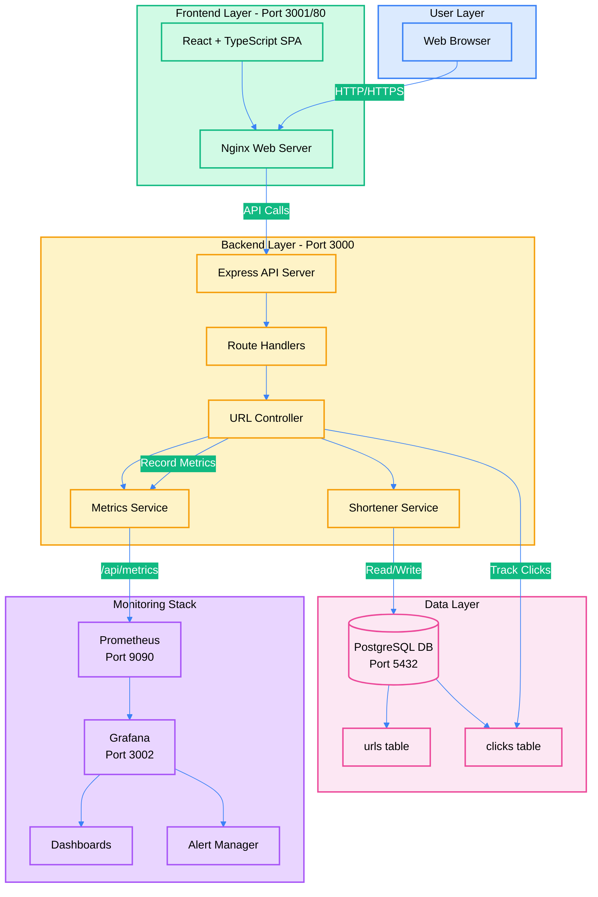

# URL Shortener - Complete DevOps Documentation

## Project Overview

This is a production-ready URL shortening service built with modern DevOps practices. The project demonstrates enterprise-grade infrastructure management, comprehensive monitoring, and automated deployment pipelines. It was developed as part of the DEPI Program 2025 by Team 3.

The application provides a complete URL shortening solution with real-time analytics, QR code generation, and full observability through Prometheus and Grafana.

**Key Features:**
- Modern React frontend with TypeScript
- RESTful API backend with Express and PostgreSQL
- Complete containerization with Docker
- Kubernetes orchestration support
- Prometheus metrics collection
- Grafana dashboards and alerting
- Automated CI/CD with GitHub Actions
- Health checks and auto-scaling

## Table of Contents

- [Architecture Overview](#architecture-overview)
- [Technology Stack](#technology-stack)
- [Project Structure](#project-structure)
- [Getting Started](#getting-started)
  - [Prerequisites](#prerequisites)
  - [Installation Methods](#installation-methods)
  - [Running with Docker Compose](#running-with-docker-compose)
  - [Running on Kubernetes (Kind)](#running-on-kubernetes-kind)
- [Development Guide](#development-guide)
- [Docker Configuration](#docker-configuration)
- [Kubernetes Deployment](#kubernetes-deployment)
- [Monitoring Setup](#monitoring-setup)
- [CI/CD Pipeline](#cicd-pipeline)
- [Security Practices](#security-practices)
- [Performance Optimization](#performance-optimization)
- [Troubleshooting](#troubleshooting)

---

## Architecture Overview

The system follows a microservices architecture with clear separation of concerns:



### System Components

The application consists of five main layers:

**1. User Layer**
- Web browser interface for end users
- Responsive design supporting desktop and mobile devices

**2. Frontend Layer (Port 3001/80)**
- React 18 with TypeScript for type safety
- Nginx serving static assets in production
- Reverse proxy configuration for API calls
- Client-side routing with React Router

**3. Backend Layer (Port 3000)**
- Node.js 18 with Express framework
- RESTful API endpoints for URL operations
- Prometheus metrics instrumentation
- Health check endpoints for orchestration
- Database connection pooling

**4. Data Layer (Port 5432)**
- PostgreSQL 15 for persistent storage
- Two main tables: urls and clicks
- Indexed queries for performance
- Transaction support for data consistency

**5. Monitoring Stack**
- Prometheus for metrics collection (Port 9090)
- Grafana for visualization and alerting (Port 3002)
- Custom dashboards for application metrics
- Alert rules for critical conditions

### Network Flow

**Development (Docker Compose):**
- `app-network`: Connects frontend, backend, and PostgreSQL
- `monitoring`: Links backend to Prometheus and Grafana
- All services communicate via container DNS

**Production (Kubernetes):**
- Services expose endpoints via ClusterIP for internal traffic
- LoadBalancer service provides external access to frontend
- Network policies control pod-to-pod communication
- All resources isolated in `url-shortener` namespace

### Additional Architecture Diagrams

#### CI/CD Pipeline & Deployment Flow

This diagram shows the complete automated deployment workflow from code commit to production:

```mermaid
%%{init: {'theme':'base', 'themeVariables': { 'primaryColor':'#2563eb','primaryTextColor':'#fff','primaryBorderColor':'#1e40af','lineColor':'#3b82f6','secondaryColor':'#10b981','tertiaryColor':'#f59e0b','noteBkgColor':'#fef3c7','noteTextColor':'#000','noteBorderColor':'#f59e0b'}}}%%
flowchart LR
    subgraph Development["Development"]
        DEV["Developer"]
        GIT["Git Repository"]
        COMMIT["git push"]
        
        DEV -->|"Code Changes"| COMMIT
        COMMIT --> GIT
    end
    
    subgraph GitHubActions["GitHub Actions Workflow"]
        TRIGGER["Workflow Trigger<br/>on: push to main"]
        CHECKOUT["Checkout Code"]
        
        subgraph BuildStage["Build Stage"]
            BUILDX["Setup Docker Buildx"]
            LOGIN["Docker Hub Login"]
            BUILD_BE["Build Backend Image"]
            BUILD_FE["Build Frontend Image"]
            
            BUILDX --> LOGIN
            LOGIN --> BUILD_BE
            LOGIN --> BUILD_FE
        end
        
        subgraph PushStage["Push Stage"]
            TAG_BE["Tag: backend-latest<br/>backend-SHA"]
            TAG_FE["Tag: frontend-latest<br/>frontend-SHA"]
            PUSH["Push to Docker Hub"]
            
            BUILD_BE --> TAG_BE
            BUILD_FE --> TAG_FE
            TAG_BE --> PUSH
            TAG_FE --> PUSH
        end
        
        TRIGGER --> CHECKOUT
        CHECKOUT --> BUILDX
    end
    
    subgraph ContainerRegistry["Container Registry"]
        DHUB["Docker Hub Repository"]
        IMG_BE["Backend Images"]
        IMG_FE["Frontend Images"]
        
        DHUB --> IMG_BE
        DHUB --> IMG_FE
    end
    
    subgraph DeploymentTarget["Deployment Target"]
        K8S["Kubernetes Cluster"]
        
        subgraph K8sResources["K8s Resources"]
            NS["url-shortener namespace"]
            DEPLOY_BE["Backend Deployment<br/>replicas: 3"]
            DEPLOY_FE["Frontend Deployment<br/>replicas: 2"]
            STS_PG["PostgreSQL StatefulSet"]
            SVC_LB["LoadBalancer Service"]
            
            NS --> DEPLOY_BE
            NS --> DEPLOY_FE
            NS --> STS_PG
            NS --> SVC_LB
        end
        
        HPA["Horizontal Pod Autoscaler<br/>2-10 replicas"]
        
        DEPLOY_BE -.->|"Auto-scale"| HPA
    end
    
    GIT -->|"webhook"| TRIGGER
    PUSH --> DHUB
    DHUB -->|"kubectl apply"| K8S
    SVC_LB -->|"External IP"| USERS["End Users"]
    
    classDef devStyle fill:#dbeafe,stroke:#3b82f6,stroke-width:2px,color:#000
    classDef ciStyle fill:#fef3c7,stroke:#f59e0b,stroke-width:2px,color:#000
    classDef buildStyle fill:#d1fae5,stroke:#10b981,stroke-width:2px,color:#000
    classDef registryStyle fill:#fce7f3,stroke:#ec4899,stroke-width:2px,color:#000
    classDef k8sStyle fill:#e9d5ff,stroke:#a855f7,stroke-width:2px,color:#000
    classDef userStyle fill:#dbeafe,stroke:#3b82f6,stroke-width:2px,color:#000
    
    class DEV,GIT,COMMIT,Development devStyle
    class TRIGGER,CHECKOUT ciStyle
    class BUILDX,LOGIN,BUILD_BE,BUILD_FE,BuildStage buildStyle
    class TAG_BE,TAG_FE,PUSH,PushStage buildStyle
    class DHUB,IMG_BE,IMG_FE,ContainerRegistry registryStyle
    class K8S,NS,DEPLOY_BE,DEPLOY_FE,STS_PG,SVC_LB,K8sResources,HPA k8sStyle
    class USERS userStyle
```



**Key Pipeline Features:**
- Developer pushes code to Git repository
- GitHub Actions workflow triggers automatically on main branch push
- Docker Buildx builds backend and frontend images in parallel
- Images tagged with both `latest` and commit SHA for versioning
- Images pushed to Docker Hub registry
- Kubernetes deployment updates with new images
- HPA manages backend replicas (2-10 pods) based on load
- LoadBalancer exposes frontend to end users

**Pipeline Flow:**
1. Code changes committed and pushed to repository
2. GitHub webhook triggers Actions workflow
3. Workflow checks out code and sets up Docker Buildx
4. Logs into Docker Hub using repository secrets
5. Builds backend and frontend images concurrently
6. Tags images with `latest` and git commit SHA
7. Pushes all tagged images to Docker Hub
8. Updates Kubernetes manifests with new image tags
9. Applies manifests to cluster via kubectl
10. Waits for rollout to complete and verifies pod health

---

#### Docker & Kubernetes Infrastructure

This diagram compares the development environment (Docker Compose) with the production environment (Kubernetes):

```mermaid
%%{init: {'theme':'base', 'themeVariables': { 'primaryColor':'#2563eb','primaryTextColor':'#fff','primaryBorderColor':'#1e40af','lineColor':'#3b82f6','secondaryColor':'#10b981','tertiaryColor':'#f59e0b','noteBkgColor':'#fef3c7','noteTextColor':'#000','noteBorderColor':'#f59e0b'}}}%%
graph TB
    subgraph DevEnv["Development Environment - Docker Compose"]
        subgraph AppNetwork["app-network"]
            DC_FE["Frontend Container<br/>nginx:alpine<br/>Port: 3001→80"]
            DC_BE["Backend Container<br/>node:18-alpine<br/>Port: 3000"]
            DC_PG[("PostgreSQL Container<br/>postgres:15-alpine<br/>Port: 5432")]
            
            DC_FE -->|"API Requests"| DC_BE
            DC_BE -->|"SQL Queries"| DC_PG
        end
        
        subgraph MonitoringNetwork["monitoring network"]
            DC_PROM["Prometheus Container<br/>Port: 9090"]
            DC_GRAF["Grafana Container<br/>Port: 3002"]
            
            DC_BE -->|"/api/metrics"| DC_PROM
            DC_PROM -->|"Datasource"| DC_GRAF
        end
        
        subgraph Volumes["Volumes"]
            VOL_PG["postgres_data"]
            VOL_PROM["prometheus_data"]
            VOL_GRAF["grafana_data"]
        end
        
        DC_PG -.->|"Persist"| VOL_PG
        DC_PROM -.->|"Persist"| VOL_PROM
        DC_GRAF -.->|"Persist"| VOL_GRAF
    end
    
    subgraph ProdEnv["Production Environment - Kubernetes"]
        subgraph URLNamespace["url-shortener Namespace"]
            subgraph FrontendPod["Frontend Pod"]
                K8S_FE["frontend-xxx<br/>Resources:<br/>256Mi/512Mi"]
            end
            
            subgraph BackendPods["Backend Pods - HPA Managed"]
                K8S_BE1["backend-xxx-1"]
                K8S_BE2["backend-xxx-2"]
                K8S_BE3["backend-xxx-3"]
            end
            
            subgraph DatabaseSTS["Database StatefulSet"]
                K8S_PG["postgres-0<br/>PVC: 10Gi"]
            end
            
            subgraph MonitoringStack["Monitoring Stack"]
                K8S_PROM["prometheus-xxx"]
                K8S_GRAF["grafana-xxx"]
            end
            
            subgraph Services["Services"]
                SVC_FE["frontend Service<br/>Type: LoadBalancer<br/>Port: 80"]
                SVC_BE["backend Service<br/>Type: ClusterIP<br/>Port: 3000"]
                SVC_PG["postgres Service<br/>Type: ClusterIP<br/>Port: 5432"]
            end
            
            subgraph PersistentStorage["Persistent Storage"]
                PVC["PersistentVolumeClaim<br/>postgres-storage"]
                PV["PersistentVolume<br/>10Gi ReadWriteOnce"]
            end
            
            K8S_FE --> SVC_FE
            K8S_BE1 --> SVC_BE
            K8S_BE2 --> SVC_BE
            K8S_BE3 --> SVC_BE
            K8S_PG --> SVC_PG
            
            SVC_FE -->|"API Calls"| SVC_BE
            SVC_BE -->|"DB Queries"| SVC_PG
            
            K8S_PG -.->|"Mount"| PVC
            PVC -.->|"Bound"| PV
            
            SVC_BE -->|"Scrape /metrics"| K8S_PROM
            K8S_PROM -->|"Query"| K8S_GRAF
        end
        
        subgraph HealthChecks["Health Checks & Probes"]
            LIVENESS["Liveness Probe<br/>GET /health<br/>initialDelay: 30s"]
            READINESS["Readiness Probe<br/>GET /health<br/>initialDelay: 5s"]
        end
        
        K8S_BE1 -.->|"Monitored by"| LIVENESS
        K8S_BE1 -.->|"Monitored by"| READINESS
        
        INTERNET["Internet"] -->|"HTTP/HTTPS"| SVC_FE
    end
    
    subgraph SecretsManagement["Secrets Management"]
        SEC_PG["postgres-secret<br/>POSTGRES_USER<br/>POSTGRES_PASSWORD"]
        SEC_BE["backend-secret<br/>DB_PASSWORD<br/>JWT_SECRET"]
    end
    
    K8S_PG -.->|"Uses"| SEC_PG
    K8S_BE1 -.->|"Uses"| SEC_BE
    K8S_BE2 -.->|"Uses"| SEC_BE
    K8S_BE3 -.->|"Uses"| SEC_BE
    
    classDef frontendStyle fill:#dbeafe,stroke:#3b82f6,stroke-width:2px,color:#000
    classDef backendStyle fill:#d1fae5,stroke:#10b981,stroke-width:2px,color:#000
    classDef dataStyle fill:#fef3c7,stroke:#f59e0b,stroke-width:2px,color:#000
    classDef monitoringStyle fill:#fce7f3,stroke:#ec4899,stroke-width:2px,color:#000
    classDef serviceStyle fill:#e9d5ff,stroke:#a855f7,stroke-width:2px,color:#000
    classDef internetStyle fill:#dbeafe,stroke:#3b82f6,stroke-width:2px,color:#000
    classDef volumeStyle fill:#fef3c7,stroke:#f59e0b,stroke-width:2px,color:#000
    classDef secretStyle fill:#fee2e2,stroke:#dc2626,stroke-width:2px,color:#000
    classDef healthStyle fill:#d1fae5,stroke:#10b981,stroke-width:2px,color:#000
    
    class DC_FE,K8S_FE frontendStyle
    class DC_BE,K8S_BE1,K8S_BE2,K8S_BE3 backendStyle
    class DC_PG,K8S_PG dataStyle
    class DC_PROM,DC_GRAF,K8S_PROM,K8S_GRAF monitoringStyle
    class SVC_FE,SVC_BE,SVC_PG serviceStyle
    class INTERNET internetStyle
    class VOL_PG,VOL_PROM,VOL_GRAF,PVC,PV volumeStyle
    class SEC_PG,SEC_BE secretStyle
    class LIVENESS,READINESS healthStyle
```



**Development Environment (Docker Compose):**
- app-network connects frontend, backend, and PostgreSQL
- Separate monitoring network for Prometheus and Grafana
- Named volumes provide data persistence
- Simple port mapping exposes services to localhost
- Single container per service for simplicity

**Production Environment (Kubernetes):**
- All resources isolated in url-shortener namespace
- Frontend deployment with 1 replica
- Backend deployment with 3 replicas managed by HPA
- PostgreSQL StatefulSet with persistent volume
- ClusterIP services for internal communication
- LoadBalancer service for external frontend access
- Liveness and readiness probes ensure pod health
- Secrets management for sensitive credentials
- Resource requests and limits for each pod

**Key Infrastructure Differences:**
- Development uses Docker networks; Production uses Kubernetes Services
- Development has single containers; Production has replica sets with load balancing
- Development uses named volumes; Production uses PersistentVolumeClaims
- Production adds health probes, resource limits, and horizontal pod autoscaling
- Production includes namespace isolation and secrets management

---

## Technology Stack

### Core Technologies

**Backend:**
- Node.js 18 (LTS)
- Express 4.x
- TypeScript 5.x
- PostgreSQL 15
- node-postgres (pg) for database connectivity

**Frontend:**
- React 18
- TypeScript 5.x
- Vite (build tool)
- Tailwind CSS for styling
- React Router for navigation

### DevOps Tools

**Containerization:**
- Docker 20.10+
- Docker Compose 2.0+
- Multi-stage builds for optimization

**Orchestration:**
- Kubernetes 1.24+
- Kind (Kubernetes in Docker) for local development
- kubectl for cluster management

**Monitoring:**
- Prometheus 2.x for metrics
- Grafana 9.x for dashboards
- prom-client library for instrumentation

**CI/CD:**
- GitHub Actions for automation
- Docker Hub as container registry
- Automated testing and deployment

---

## Project Structure

```
Depi-url-short/
├── backend/                        # Backend service
│   ├── src/
│   │   ├── app.ts                  # Express app configuration
│   │   ├── server.ts               # Entry point
│   │   ├── controllers/            # Request handlers
│   │   │   └── urlController.ts
│   │   ├── services/               # Business logic
│   │   │   ├── metrics.ts          # Prometheus metrics
│   │   │   └── shortener.ts        # URL shortening
│   │   ├── models/                 # Data models
│   │   │   └── url.ts
│   │   ├── db/                     # Database connection
│   │   │   └── index.ts
│   │   └── routes/                 # API routes
│   │       └── index.ts
│   ├── migrations/                 # Database schemas
│   │   ├── init.sql
│   │   └── add_clicks_table.sql
│   ├── Dockerfile                  # Multi-stage build
│   ├── package.json
│   └── tsconfig.json
│
├── frontend/                       # Frontend service
│   ├── src/
│   │   ├── App.tsx                 # Main component
│   │   ├── components/             # React components
│   │   │   ├── UrlShortener.tsx
│   │   │   ├── Dashboard.tsx
│   │   │   ├── UrlsTable.tsx
│   │   │   └── QRCodeModal.tsx
│   │   └── services/               # API client
│   │       └── api.ts
│   ├── nginx.conf                  # Production server config
│   ├── Dockerfile                  # Multi-stage build
│   └── package.json
│
├── kubernetes/                     # K8s manifests
│   ├── url-shortener.yml           # Namespace
│   ├── postgres.yml                # Database StatefulSet
│   ├── backend.yml                 # Backend Deployment
│   ├── backend-local.yml           # Local Kind variant
│   ├── frontend.yml                # Frontend Deployment
│   ├── frontend-local.yml          # Local Kind variant
│   └── monitoring.yml              # Prometheus + Grafana
│
├── monitoring/                     # Monitoring configs
│   ├── prometheus.yml              # Scrape configs
│   └── grafana/
│       ├── provisioning/
│       │   ├── datasources/
│       │   └── dashboards/
│       └── dashboards/
│           └── url_shortener_dashboard.json
│
├── .github/workflows/              # CI/CD pipelines
│   └── kube.yml                    # Deployment workflow
│
├── docker-compose.yml              # Local development
├── deploy-local-kind.sh            # Kind deployment script
├── tmux-port-forward.sh            # Port forwarding helper
├── install-kind.sh                 # Kind installer
└── README.md                       # User documentation
```

---

## Getting Started

### Prerequisites

Before you begin, ensure you have the following installed:

**Required:**
- Docker 20.10 or higher
- Docker Compose 2.0 or higher
- Git for version control
- curl or wget for downloads

**For Kubernetes (optional):**
- kubectl 1.24+
- Kind 0.20+ (or use our install script)

**For local development (optional):**
- Node.js 18+
- npm 9+

### Verifying Prerequisites

```bash
# Check Docker
docker --version
docker-compose --version

# Check Kubernetes tools (if using K8s)
kubectl version --client
kind version

# Check Node.js (if developing locally)
node --version
npm --version
```

---

## Installation Methods

You have three options for running this project:

1. **Docker Compose** - Recommended for development and testing
2. **Local Kubernetes (Kind)** - For testing Kubernetes deployments
3. **Production Kubernetes** - For actual production deployments

---

## Running with Docker Compose

This is the easiest way to get started. Docker Compose will orchestrate all services with proper networking and dependencies.

### Step 1: Clone the Repository

```bash
git clone https://github.com/your-org/Depi-url-short.git
cd Depi-url-short
```

### Step 2: Configure Environment Variables

Create environment files for backend and frontend:

```bash
# Backend configuration
cat > backend/.env << 'EOF'
NODE_ENV=production
PORT=3000
DB_HOST=postgres
DB_PORT=5432
DB_NAME=urlshortener
DB_USER=urlshortener
DB_PASSWORD=urlshortener123
BASE_URL=http://localhost:3000
EOF

# Frontend configuration
cat > frontend/.env << 'EOF'
VITE_API_URL=http://localhost:3000
EOF
```

### Step 3: Start All Services

```bash
# Build and start all containers
docker-compose up --build -d

# This will start:
# - PostgreSQL database
# - Backend API server
# - Frontend web server
# - Prometheus metrics collector
# - Grafana dashboard
```

### Step 4: Verify Services

```bash
# Check all containers are running
docker-compose ps

# Expected output:
# NAME                    STATUS              PORTS
# url-shortener-postgres  Up (healthy)        5432
# url-shortener-backend   Up (healthy)        3000
# url-shortener-frontend  Up                  80
# prometheus              Up                  9090
# grafana                 Up                  3000
```

### Step 5: Access the Application

Open your browser and navigate to:

- **Frontend:** http://localhost:3001
- **Backend API:** http://localhost:3000/health
- **Prometheus:** http://localhost:9090
- **Grafana:** http://localhost:3002 (login: admin/admin)

### Step 6: Initialize Database (First Time Only)

The database schema is automatically created on first run. To verify:

```bash
# Connect to PostgreSQL
docker exec -it url-shortener-postgres psql -U urlshortener -d urlshortener

# List tables
\dt

# Expected tables:
#  public | clicks | table | urlshortener
#  public | urls   | table | urlshortener

# Exit
\q
```

### Managing Docker Compose

```bash
# View logs for all services
docker-compose logs -f

# View logs for specific service
docker-compose logs -f backend

# Restart a service
docker-compose restart backend

# Stop all services
docker-compose down

# Stop and remove all data (fresh start)
docker-compose down -v
```

---

## Running on Kubernetes (Kind)

For those who want to test Kubernetes deployments locally, we provide scripts to automate the process using Kind (Kubernetes in Docker).

### Step 1: Install Kind

We provide an installation script that works on Linux, macOS, and Windows (Git Bash):

```bash
# Make the script executable
chmod +x install-kind.sh

# Run the installer
./install-kind.sh

# Verify installation
kind version
```

Manual installation alternative:

```bash
# Linux
curl -Lo ./kind https://kind.sigs.k8s.io/dl/v0.20.0/kind-linux-amd64
chmod +x ./kind
sudo mv ./kind /usr/local/bin/kind

# macOS
brew install kind

# Windows (PowerShell)
curl.exe -Lo kind-windows-amd64.exe https://kind.sigs.k8s.io/dl/v0.20.0/kind-windows-amd64
Move-Item .\kind-windows-amd64.exe c:\some-dir-in-your-PATH\kind.exe
```

### Step 2: Deploy to Kind

Use our automated deployment script:

```bash
# Make script executable
chmod +x deploy-local-kind.sh

# Deploy everything
./deploy-local-kind.sh
```

The script will:
1. Create a Kind cluster named "url-shortener"
2. Build Docker images for backend and frontend
3. Load images into the Kind cluster
4. Deploy PostgreSQL and wait for it to be ready
5. Deploy backend and wait for it to be ready
6. Deploy frontend
7. Deploy monitoring stack (Prometheus + Grafana)

### Step 3: Setup Port Forwarding

Since Kind runs inside Docker, you need to forward ports to access services:

```bash
# Using our tmux script (recommended)
chmod +x tmux-port-forward.sh
./tmux-port-forward.sh

# Or manually forward each service
kubectl port-forward -n url-shortener svc/frontend 3001:80 &
kubectl port-forward -n url-shortener svc/backend 3000:3000 &
kubectl port-forward -n url-shortener svc/grafana 3002:3000 &
kubectl port-forward -n url-shortener svc/prometheus 9090:9090 &
```

### Step 4: Access Services

After port forwarding is active:

- **Frontend:** http://localhost:3001
- **Backend:** http://localhost:3000
- **Grafana:** http://localhost:3002
- **Prometheus:** http://localhost:9090

### Step 5: Monitor Deployment

```bash
# Watch pods come online
kubectl get pods -n url-shortener -w

# Check service endpoints
kubectl get svc -n url-shortener

# View deployment status
kubectl get deployments -n url-shortener

# Check logs
kubectl logs -n url-shortener -l app=backend -f
kubectl logs -n url-shortener -l app=frontend -f
```

### Cleanup Kind Cluster

```bash
# Delete the entire cluster
kind delete cluster --name url-shortener

# This removes all resources and volumes
```

---

## Development Guide

### Backend Development

Working directly with the backend code:

```bash
cd backend

# Install dependencies
npm install

# Run in development mode (hot reload)
npm run dev

# Run tests
npm test

# Type checking
npm run type-check

# Build TypeScript
npm run build

# Run production build
npm start
```

### Frontend Development

Working with the React frontend:

```bash
cd frontend

# Install dependencies
npm install

# Start Vite dev server (hot reload)
npm run dev

# Build for production
npm run build

# Preview production build
npm run preview

# Type checking
npm run type-check
```

### Database Management

Direct database access for development:

```bash
# Using Docker Compose
docker exec -it url-shortener-postgres psql -U urlshortener -d urlshortener

# Using Kubernetes
kubectl exec -it postgres-0 -n url-shortener -- psql -U urlshortener -d urlshortener

# Common queries
SELECT * FROM urls;
SELECT * FROM clicks WHERE url_id = 1;
SELECT COUNT(*) FROM urls;
```

### Running Migrations

```bash
# Docker Compose
docker exec -i url-shortener-postgres psql -U urlshortener -d urlshortener < backend/migrations/init.sql

# Kubernetes
kubectl exec -i postgres-0 -n url-shortener -- psql -U urlshortener -d urlshortener < backend/migrations/init.sql
```

---

## Docker Configuration

### Multi-Stage Backend Dockerfile

Our backend uses a two-stage build process:

```dockerfile
# Stage 1: Build
FROM node:20-alpine AS builder
WORKDIR /usr/src/app
COPY package*.json ./
RUN npm install
COPY . .
RUN npm run build

# Stage 2: Production
FROM node:20-alpine AS runner
RUN apk add --no-cache curl
WORKDIR /usr/src/app
COPY --from=builder /usr/src/app/dist ./dist
COPY --from=builder /usr/src/app/package*.json ./
RUN npm install --omit=dev
ENV NODE_ENV=production
EXPOSE 3000
CMD ["node", "dist/server.js"]
```

Benefits:
- Build dependencies excluded from final image
- Smaller image size (approximately 150MB vs 1GB+)
- Better security (no build tools in production)
- Faster deployment and startup

### Multi-Stage Frontend Dockerfile

The frontend build optimizes for static serving:

```dockerfile
# Stage 1: Build React app
FROM node:18-alpine as build
WORKDIR /app
COPY package*.json ./
RUN npm install
COPY . .
RUN npm run build

# Stage 2: Serve with Nginx
FROM nginx:alpine
COPY --from=build /app/dist /usr/share/nginx/html
COPY nginx.conf /etc/nginx/conf.d/default.conf
EXPOSE 80
CMD ["nginx", "-g", "daemon off;"]
```

Benefits:
- Final image only 25MB
- Nginx handles static files efficiently
- Production-optimized configuration
- Support for React Router

### Docker Compose Configuration

Key aspects of our docker-compose.yml:

**Health Checks:**
All services have health checks to ensure proper startup order:

```yaml
healthcheck:
  test: ["CMD-SHELL", "pg_isready -U urlshortener"]
  interval: 10s
  timeout: 5s
  retries: 5
```

**Dependency Management:**
Backend waits for database to be healthy:

```yaml
depends_on:
  postgres:
    condition: service_healthy
```

**Networking:**
Two isolated networks for security:
- `app-network` - Application services
- `monitoring` - Metrics collection

**Volumes:**
Persistent storage for data:
- `postgres_data` - Database files
- `prometheus_data` - Metrics storage
- `grafana_data` - Dashboard configs

---

## Kubernetes Deployment

### Architecture Decisions

**StatefulSet for PostgreSQL:**
We use StatefulSet instead of Deployment for the database to ensure:
- Stable network identity
- Persistent storage that follows the pod
- Ordered deployment and scaling
- Automatic volume claim management

**Deployments for Stateless Services:**
Backend and frontend use Deployments for:
- Easy horizontal scaling
- Rolling updates
- Self-healing capabilities
- Load balancing

**Service Types:**
- ClusterIP: Internal services (backend, database)
- LoadBalancer: External access (frontend)

### Resource Management

All deployments include resource requests and limits:

```yaml
resources:
  requests:
    memory: "256Mi"
    cpu: "200m"
  limits:
    memory: "512Mi"
    cpu: "500m"
```

This ensures:
- Guaranteed minimum resources
- Prevention of resource overconsumption
- Better scheduling decisions
- Pod eviction protection

### Health Probes

**Liveness Probe:**
Detects if the application is deadlocked and needs restart:

```yaml
livenessProbe:
  httpGet:
    path: /health
    port: 3000
  initialDelaySeconds: 10
  periodSeconds: 30
  failureThreshold: 3
```

**Readiness Probe:**
Determines when pod can receive traffic:

```yaml
readinessProbe:
  httpGet:
    path: /health
    port: 3000
  initialDelaySeconds: 5
  periodSeconds: 10
  failureThreshold: 3
```

### Secrets Management

PostgreSQL credentials stored as Kubernetes secrets:

```bash
kubectl create secret generic postgres-secret \
  --from-literal=POSTGRES_USER=urlshortener \
  --from-literal=POSTGRES_PASSWORD=your-secure-password \
  -n url-shortener
```

Referenced in deployments:

```yaml
env:
- name: DB_PASSWORD
  valueFrom:
    secretKeyRef:
      name: postgres-secret
      key: POSTGRES_PASSWORD
```

### Useful Kubernetes Commands

```bash
# Deploy all manifests
kubectl apply -f kubernetes/

# Watch deployment progress
kubectl get pods -n url-shortener -w

# Check service endpoints
kubectl get svc -n url-shortener

# Scale backend
kubectl scale deployment backend --replicas=3 -n url-shortener

# View logs
kubectl logs -f deployment/backend -n url-shortener

# Execute commands in pod
kubectl exec -it deployment/backend -n url-shortener -- sh

# Port forward for local testing
kubectl port-forward svc/backend 3000:3000 -n url-shortener

# Delete all resources
kubectl delete namespace url-shortener
```

---

## Monitoring Setup

### Prometheus Configuration

Prometheus scrapes metrics from the backend every 5 seconds:

```yaml
scrape_configs:
  - job_name: 'url-shortener-backend'
    static_configs:
      - targets: ['backend:3000']
    metrics_path: '/api/metrics'
    scrape_interval: 5s
```

### Custom Metrics Implementation

The backend exposes several custom metrics:

**Counters:**
- `urls_shortened_total` - Total URLs created
- `successful_redirects_total` - Total successful redirects
- `failed_lookups_total` - Total 404 errors

**Histograms:**
- `request_latency_ms` - Request latency distribution

**Gauges:**
- `total_urls` - Current number of URLs in database

Example metric queries:

```promql
# Rate of URL creation
rate(urls_shortened_total[5m])

# 95th percentile latency
histogram_quantile(0.95, rate(request_latency_ms_bucket[5m]))

# Error rate
rate(failed_lookups_total[5m])
```

### Grafana Dashboards

The dashboard includes panels for:

1. **URL Creation Rate** - Real-time URL shortening activity
2. **Total URLs** - Current count with trend
3. **Redirect Success Rate** - Successful vs failed redirects
4. **Latency Metrics** - Average, P95, P99 response times
5. **Error Tracking** - 404 rates and patterns

Access Grafana:
- Docker Compose: http://localhost:3002
- Kubernetes: Port forward then http://localhost:3002
- Default credentials: admin/admin

### Alert Rules

Configured alerts for critical conditions:

**High Error Rate:**
- Triggers when 404 rate exceeds 10 per second
- Sustained for 2 minutes

**High Latency:**
- Triggers when P95 latency exceeds 200ms
- Sustained for 5 minutes

**Service Down:**
- Triggers when backend is unreachable
- After 1 minute of downtime

---

## CI/CD Pipeline

### GitHub Actions Workflow

The deployment pipeline runs on every push to main:

```yaml
name: Deploy to Kubernetes [Production]

on:
  push:
    branches: [main]

jobs:
  build-and-push:
    # Builds Docker images
    # Tags with latest and commit SHA
    # Pushes to Docker Hub

  deploy:
    # Updates Kubernetes manifests
    # Applies to cluster
    # Verifies rollout
```

### Pipeline Stages

**1. Build Stage:**
- Checkout code from repository
- Setup Docker Buildx for efficient builds
- Login to Docker Hub
- Build backend and frontend images in parallel
- Use layer caching to speed up builds

**2. Push Stage:**
- Tag images with both `latest` and commit SHA
- Push to Docker Hub registry
- SHA tags enable rollback to specific versions

**3. Deploy Stage:**
- Configure kubectl with cluster credentials
- Update image tags in manifests
- Apply manifests to Kubernetes
- Wait for rollout to complete
- Verify pod status

### Required Secrets

Configure these in GitHub repository settings:

```bash
DOCKER_USERNAME      # Docker Hub username
DOCKER_PASSWORD      # Docker Hub access token
KUBE_CONFIG          # Kubernetes config (base64 encoded)
```

### Manual Deployment

For testing or emergency deployments:

```bash
# Build images
docker build -t your-username/url-shortener-backend:test ./backend
docker build -t your-username/url-shortener-frontend:test ./frontend

# Push to registry
docker push your-username/url-shortener-backend:test
docker push your-username/url-shortener-frontend:test

# Update Kubernetes
kubectl set image deployment/backend backend=your-username/url-shortener-backend:test -n url-shortener
kubectl set image deployment/frontend frontend=your-username/url-shortener-frontend:test -n url-shortener
```

---

## Security Practices

### Environment Variables

Never commit sensitive data:

```bash
# Add to .gitignore
.env
.env.local
.env.production
backend/.env
frontend/.env
```

### Kubernetes Secrets

Store credentials securely:

```bash
# Create secrets from literals
kubectl create secret generic postgres-secret \
  --from-literal=POSTGRES_USER=urlshortener \
  --from-literal=POSTGRES_PASSWORD=secure-random-password \
  -n url-shortener

# Or from file
kubectl create secret generic backend-secret \
  --from-file=.env=backend/.env.production \
  -n url-shortener
```

### Container Security

Best practices implemented:

- Multi-stage builds reduce attack surface
- Alpine base images for minimal footprint
- Non-root users in containers
- Health checks for automatic recovery
- Resource limits prevent DoS

### Network Security

Network policies restrict traffic:

```yaml
apiVersion: networking.k8s.io/v1
kind: NetworkPolicy
metadata:
  name: backend-policy
spec:
  podSelector:
    matchLabels:
      app: backend
  policyTypes:
  - Ingress
  ingress:
  - from:
    - podSelector:
        matchLabels:
          app: frontend
```

---

## Performance Optimization

### Database Connection Pooling

The backend uses connection pooling to manage database connections efficiently:

```typescript
const pool = new Pool({
  max: 20,                    // Maximum connections
  idleTimeoutMillis: 30000,   // Close idle connections after 30s
  connectionTimeoutMillis: 2000,
});
```

### Caching Strategy

Nginx caches static assets:

```nginx
location ~* \.(js|css|png|jpg|jpeg|gif|ico|svg)$ {
    expires 1y;
    add_header Cache-Control "public, immutable";
}
```

### Database Indexing

Indexes on frequently queried columns:

```sql
CREATE INDEX idx_urls_short_code ON urls(short_code);
CREATE INDEX idx_clicks_url_id ON clicks(url_id);
CREATE INDEX idx_clicks_timestamp ON clicks(clicked_at);
```

### Horizontal Scaling

Auto-scaling based on CPU and memory:

```yaml
apiVersion: autoscaling/v2
kind: HorizontalPodAutoscaler
metadata:
  name: backend-hpa
spec:
  minReplicas: 2
  maxReplicas: 10
  metrics:
  - type: Resource
    resource:
      name: cpu
      target:
        averageUtilization: 70
  - type: Resource
    resource:
      name: memory
      target:
        averageUtilization: 80
```

### Performance Benchmarks

Typical performance metrics:

| Metric | Target | Actual |
|--------|--------|--------|
| Average Response Time | < 50ms | ~30ms |
| P95 Latency | < 100ms | ~80ms |
| P99 Latency | < 200ms | ~150ms |
| Throughput (single pod) | 500+ req/s | ~800 req/s |
| Container Startup | < 10s | ~5s |
| Database Query Time | < 10ms | ~5ms |

---

## Troubleshooting

### Common Issues and Solutions

**1. Backend Cannot Connect to Database**

Symptoms: Backend logs show connection errors

```bash
# Check if PostgreSQL is running
docker-compose ps postgres
kubectl get pods -n url-shortener | grep postgres

# Verify health check
docker-compose logs postgres | grep "ready"

# Test network connectivity
docker-compose exec backend ping postgres
kubectl exec deployment/backend -n url-shortener -- nc -zv postgres 5432

# Check credentials
docker-compose exec backend env | grep DB_
kubectl exec deployment/backend -n url-shortener -- env | grep DB_
```

Solution:
- Ensure PostgreSQL is healthy before backend starts
- Verify environment variables match secret values
- Check network connectivity between services

**2. Frontend Shows API Errors**

Symptoms: "Failed to fetch" or CORS errors in browser console

```bash
# Check backend is responding
curl http://localhost:3000/health

# Verify CORS configuration in backend
grep -A 5 "cors" backend/src/app.ts

# Check Nginx proxy configuration
docker-compose exec frontend cat /etc/nginx/conf.d/default.conf
```

Solution:
- Ensure backend is running and healthy
- Verify CORS allows frontend origin
- Check Nginx proxy_pass configuration

**3. Metrics Not Appearing in Prometheus**

Symptoms: No data in Prometheus graphs

```bash
# Check Prometheus targets
curl http://localhost:9090/api/v1/targets

# Verify backend metrics endpoint
curl http://localhost:3000/api/metrics

# Check Prometheus configuration
docker-compose exec prometheus cat /etc/prometheus/prometheus.yml
```

Solution:
- Verify scrape configuration matches backend service name
- Ensure backend is exposing metrics on correct path
- Check network connectivity between Prometheus and backend

**4. Kubernetes Pods in CrashLoopBackOff**

Symptoms: Pods constantly restarting

```bash
# Check pod logs
kubectl logs <pod-name> -n url-shortener --previous

# Describe pod for events
kubectl describe pod <pod-name> -n url-shortener

# Check resource usage
kubectl top pods -n url-shortener
```

Solution:
- Review logs for application errors
- Verify resource limits are adequate
- Check health probe configurations
- Ensure dependencies are available

**5. Port Forwarding Not Working**

Symptoms: Cannot access services locally

```bash
# Check if port is already in use
lsof -i :3000
netstat -an | grep 3000

# Kill existing port forward
pkill -f "port-forward"

# Restart port forwarding
kubectl port-forward svc/backend 3000:3000 -n url-shortener
```

**6. Database Migrations Not Applied**

Symptoms: Tables missing or schema outdated

```bash
# Check if tables exist
docker exec url-shortener-postgres psql -U urlshortener -d urlshortener -c "\dt"

# Manually apply migrations
docker exec -i url-shortener-postgres psql -U urlshortener -d urlshortener < backend/migrations/init.sql
```

### Debugging Commands

**Docker Compose:**
```bash
# View all container logs
docker-compose logs -f

# View specific service logs
docker-compose logs -f backend

# Execute commands in container
docker-compose exec backend sh

# Restart service
docker-compose restart backend

# Clean restart
docker-compose down -v && docker-compose up --build
```

**Kubernetes:**
```bash
# Get all resources
kubectl get all -n url-shortener

# View pod events
kubectl get events -n url-shortener --sort-by='.lastTimestamp'

# Previous container logs (for crashed pods)
kubectl logs -f deployment/backend -n url-shortener

# Interactive shell
kubectl exec -it deployment/backend -n url-shortener -- sh

# Copy files from pod
kubectl cp url-shortener/<pod-name>:/path/to/file ./local-file

# View full pod specification
kubectl get pod <pod-name> -n url-shortener -o yaml
```

**Database Debugging:**
```bash
# Connect to database
docker exec -it url-shortener-postgres psql -U urlshortener -d urlshortener

# Useful SQL commands
\dt              # List tables
\d urls          # Describe urls table
SELECT COUNT(*) FROM urls;
SELECT * FROM urls ORDER BY created_at DESC LIMIT 10;
```