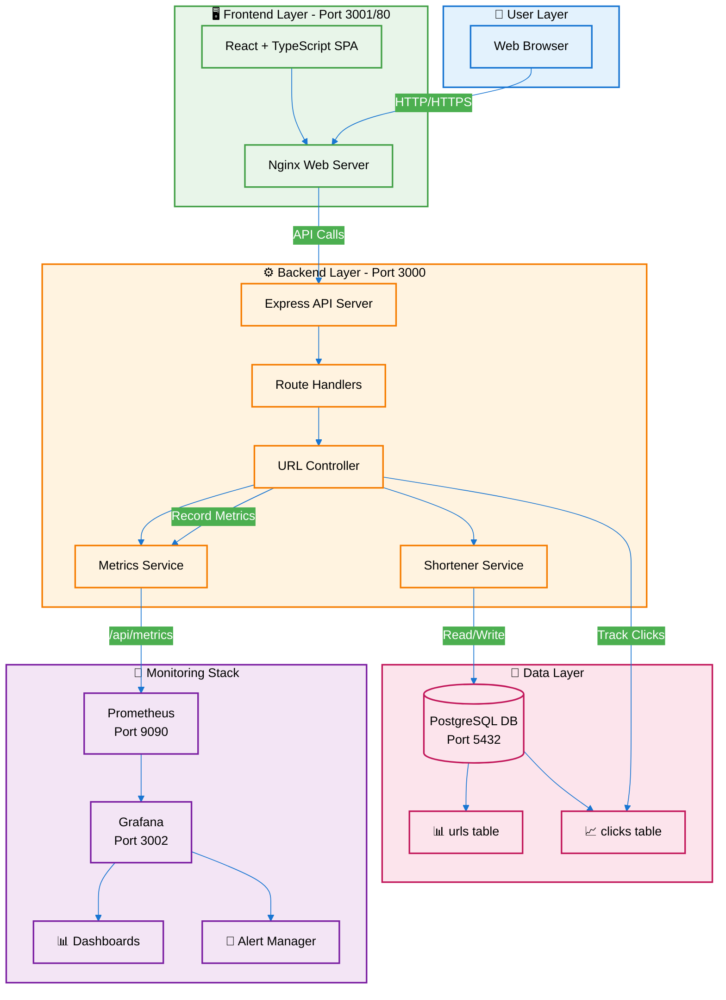

# URL Shortener - DevOps Implementation Guide

## 🚀 Project Overview

A production-ready URL shortening service built with modern DevOps practices, featuring full containerization, comprehensive monitoring, and automated deployment pipelines. This project demonstrates enterprise-grade infrastructure management, observability, and CI/CD workflows.

**DEPI Program 2025 - Team 3**

## Table of Contents

- [Architecture Overview](#architecture-overview)
- [DevOps Stack](#devops-stack)
- [Project Structure](#project-structure)
- [Quick Start](#quick-start)
- [Development Workflow](#development-workflow)
- [Docker Configuration](#docker-configuration)
- [Kubernetes Deployment](#kubernetes-deployment)
- [Monitoring & Observability](#monitoring--observability)
- [CI/CD Pipeline](#cicd-pipeline)
- [Security Best Practices](#security-best-practices)
- [Performance & Scaling](#performance--scaling)
- [Troubleshooting](#troubleshooting)

---

## Architecture Overview

## 📊 Project Diagrams

### 1. System Architecture & Data Flow




### 2. CI/CD Pipeline & Deployment Flow

```mermaid
%%{init: {'theme':'base', 'themeVariables': { 'primaryColor':'#1e88e5','primaryTextColor':'#fff','primaryBorderColor':'#0d47a1','lineColor':'#1976d2','secondaryColor':'#4caf50','tertiaryColor':'#ff9800'}}}%%
flowchart LR
    subgraph Development["💻 Development"]
        DEV["👨‍💻 Developer"]
        GIT["📁 Git Repository"]
        COMMIT["git push"]
        
        DEV -->|"Code Changes"| COMMIT
        COMMIT --> GIT
    end
    
    subgraph GitHubActions["🔄 GitHub Actions Workflow"]
        TRIGGER["⚡ Workflow Trigger<br/>on: push to main"]
        CHECKOUT["📥 Checkout Code"]
        
        subgraph BuildStage["🏗️ Build Stage"]
            BUILDX["🔧 Setup Docker Buildx"]
            LOGIN["🔐 Docker Hub Login"]
            BUILD_BE["📦 Build Backend Image"]
            BUILD_FE["📦 Build Frontend Image"]
            
            BUILDX --> LOGIN
            LOGIN --> BUILD_BE
            LOGIN --> BUILD_FE
        end
        
        subgraph PushStage["📤 Push Stage"]
            TAG_BE["🏷️ Tag: backend-latest<br/>backend-SHA"]
            TAG_FE["🏷️ Tag: frontend-latest<br/>frontend-SHA"]
            PUSH["⬆️ Push to Docker Hub"]
            
            BUILD_BE --> TAG_BE
            BUILD_FE --> TAG_FE
            TAG_BE --> PUSH
            TAG_FE --> PUSH
        end
        
        TRIGGER --> CHECKOUT
        CHECKOUT --> BUILDX
    end
    
    subgraph ContainerRegistry["📦 Container Registry"]
        DHUB["🐳 Docker Hub Repository"]
        IMG_BE["Backend Images"]
        IMG_FE["Frontend Images"]
        
        DHUB --> IMG_BE
        DHUB --> IMG_FE
    end
    
    subgraph DeploymentTarget["☸️ Deployment Target"]
        K8S["Kubernetes Cluster"]
        
        subgraph K8sResources["📋 K8s Resources"]
            NS["url-shortener namespace"]
            DEPLOY_BE["🚀 Backend Deployment<br/>replicas: 3"]
            DEPLOY_FE["🌐 Frontend Deployment<br/>replicas: 2"]
            STS_PG["💾 PostgreSQL StatefulSet"]
            SVC_LB["🌍 LoadBalancer Service"]
            
            NS --> DEPLOY_BE
            NS --> DEPLOY_FE
            NS --> STS_PG
            NS --> SVC_LB
        end
        
        HPA["📊 Horizontal Pod Autoscaler<br/>2-10 replicas"]
        
        DEPLOY_BE -.->|"Auto-scale"| HPA
    end
    
    GIT -->|"webhook"| TRIGGER
    PUSH --> DHUB
    DHUB -->|"kubectl apply"| K8S
    SVC_LB -->|"External IP"| USERS["👥 End Users"]
    
    classDef devStyle fill:#e3f2fd,stroke:#1976d2,stroke-width:2px,color:#000
    classDef ciStyle fill:#fff3e0,stroke:#f57c00,stroke-width:2px,color:#000
    classDef buildStyle fill:#e8f5e9,stroke:#43a047,stroke-width:2px,color:#000
    classDef registryStyle fill:#fce4ec,stroke:#c2185b,stroke-width:2px,color:#000
    classDef k8sStyle fill:#f3e5f5,stroke:#7b1fa2,stroke-width:2px,color:#000
    classDef userStyle fill:#e1f5fe,stroke:#0277bd,stroke-width:2px,color:#000
    
    class DEV,GIT,COMMIT,Development devStyle
    class TRIGGER,CHECKOUT ciStyle
    class BUILDX,LOGIN,BUILD_BE,BUILD_FE,BuildStage buildStyle
    class TAG_BE,TAG_FE,PUSH,PushStage buildStyle
    class DHUB,IMG_BE,IMG_FE,ContainerRegistry registryStyle
    class K8S,NS,DEPLOY_BE,DEPLOY_FE,STS_PG,SVC_LB,K8sResources,HPA k8sStyle
    class USERS userStyle
```




### 3. Docker & Kubernetes Infrastructure

```mermaid
%%{init: {'theme':'base', 'themeVariables': { 'primaryColor':'#1e88e5','primaryTextColor':'#fff','primaryBorderColor':'#0d47a1','lineColor':'#1976d2','secondaryColor':'#4caf50','tertiaryColor':'#ff9800'}}}%%
graph TB
    subgraph DevEnv["🐳 Development Environment - Docker Compose"]
        subgraph AppNetwork["app-network"]
            DC_FE["🌐 Frontend Container<br/>nginx:alpine<br/>Port: 3001→80"]
            DC_BE["⚙️ Backend Container<br/>node:18-alpine<br/>Port: 3000"]
            DC_PG[("💾 PostgreSQL Container<br/>postgres:15-alpine<br/>Port: 5432")]
            
            DC_FE -->|"API Requests"| DC_BE
            DC_BE -->|"SQL Queries"| DC_PG
        end
        
        subgraph MonitoringNetwork["monitoring network"]
            DC_PROM["📊 Prometheus Container<br/>Port: 9090"]
            DC_GRAF["📈 Grafana Container<br/>Port: 3002"]
            
            DC_BE -->|"/api/metrics"| DC_PROM
            DC_PROM -->|"Datasource"| DC_GRAF
        end
        
        subgraph Volumes["💿 Volumes"]
            VOL_PG["postgres_data"]
            VOL_PROM["prometheus_data"]
            VOL_GRAF["grafana_data"]
        end
        
        DC_PG -.->|"Persist"| VOL_PG
        DC_PROM -.->|"Persist"| VOL_PROM
        DC_GRAF -.->|"Persist"| VOL_GRAF
    end
    
    subgraph ProdEnv["☸️ Production Environment - Kubernetes"]
        subgraph URLNamespace["url-shortener Namespace"]
            subgraph FrontendPod["Frontend Pod"]
                K8S_FE["🌐 frontend-xxx<br/>Resources:<br/>256Mi/512Mi"]
            end
            
            subgraph BackendPods["Backend Pods - HPA Managed"]
                K8S_BE1["⚙️ backend-xxx-1"]
                K8S_BE2["⚙️ backend-xxx-2"]
                K8S_BE3["⚙️ backend-xxx-3"]
            end
            
            subgraph DatabaseSTS["Database StatefulSet"]
                K8S_PG["💾 postgres-0<br/>PVC: 10Gi"]
            end
            
            subgraph MonitoringStack["Monitoring Stack"]
                K8S_PROM["📊 prometheus-xxx"]
                K8S_GRAF["📈 grafana-xxx"]
            end
            
            subgraph Services["Services"]
                SVC_FE["🌍 frontend Service<br/>Type: LoadBalancer<br/>Port: 80"]
                SVC_BE["🔗 backend Service<br/>Type: ClusterIP<br/>Port: 3000"]
                SVC_PG["🗄️ postgres Service<br/>Type: ClusterIP<br/>Port: 5432"]
            end
            
            subgraph PersistentStorage["💿 Persistent Storage"]
                PVC["PersistentVolumeClaim<br/>postgres-storage"]
                PV["PersistentVolume<br/>10Gi ReadWriteOnce"]
            end
            
            K8S_FE --> SVC_FE
            K8S_BE1 --> SVC_BE
            K8S_BE2 --> SVC_BE
            K8S_BE3 --> SVC_BE
            K8S_PG --> SVC_PG
            
            SVC_FE -->|"API Calls"| SVC_BE
            SVC_BE -->|"DB Queries"| SVC_PG
            
            K8S_PG -.->|"Mount"| PVC
            PVC -.->|"Bound"| PV
            
            SVC_BE -->|"Scrape /metrics"| K8S_PROM
            K8S_PROM -->|"Query"| K8S_GRAF
        end
        
        subgraph HealthChecks["💚 Health Checks & Probes"]
            LIVENESS["✅ Liveness Probe<br/>GET /health<br/>initialDelay: 30s"]
            READINESS["🔍 Readiness Probe<br/>GET /health<br/>initialDelay: 5s"]
        end
        
        K8S_BE1 -.->|"Monitored by"| LIVENESS
        K8S_BE1 -.->|"Monitored by"| READINESS
        
        INTERNET["🌐 Internet"] -->|"HTTP/HTTPS"| SVC_FE
    end
    
    subgraph SecretsManagement["🔐 Secrets Management"]
        SEC_PG["postgres-secret<br/>POSTGRES_USER<br/>POSTGRES_PASSWORD"]
        SEC_BE["backend-secret<br/>DB_PASSWORD<br/>JWT_SECRET"]
    end
    
    K8S_PG -.->|"Uses"| SEC_PG
    K8S_BE1 -.->|"Uses"| SEC_BE
    K8S_BE2 -.->|"Uses"| SEC_BE
    K8S_BE3 -.->|"Uses"| SEC_BE
    
    classDef frontendStyle fill:#e3f2fd,stroke:#1976d2,stroke-width:2px,color:#000
    classDef backendStyle fill:#e8f5e9,stroke:#43a047,stroke-width:2px,color:#000
    classDef dataStyle fill:#fff3e0,stroke:#f57c00,stroke-width:2px,color:#000
    classDef monitoringStyle fill:#fce4ec,stroke:#c2185b,stroke-width:2px,color:#000
    classDef serviceStyle fill:#f3e5f5,stroke:#7b1fa2,stroke-width:2px,color:#000
    classDef internetStyle fill:#e1f5fe,stroke:#0277bd,stroke-width:2px,color:#000
    classDef volumeStyle fill:#fff9c4,stroke:#f9a825,stroke-width:2px,color:#000
    classDef secretStyle fill:#ffebee,stroke:#c62828,stroke-width:2px,color:#000
    classDef healthStyle fill:#e0f2f1,stroke:#00695c,stroke-width:2px,color:#000
    
    class DC_FE,K8S_FE frontendStyle
    class DC_BE,K8S_BE1,K8S_BE2,K8S_BE3 backendStyle
    class DC_PG,K8S_PG dataStyle
    class DC_PROM,DC_GRAF,K8S_PROM,K8S_GRAF monitoringStyle
    class SVC_FE,SVC_BE,SVC_PG serviceStyle
    class INTERNET internetStyle
    class VOL_PG,VOL_PROM,VOL_GRAF,PVC,PV volumeStyle
    class SEC_PG,SEC_BE secretStyle
    class LIVENESS,READINESS healthStyle
```




### Diagram Explanations

#### Diagram 1: System Architecture & Data Flow
**Purpose**: Shows the complete system architecture and how data flows between components

**Key Features**:
- 👤 **User interaction layer** - Web browser accessing the application
- 🖥️ **Frontend SPA** - React + TypeScript served by Nginx
- ⚙️ **Backend API** - Express server with layered architecture (Routes → Controller → Services)
- 💾 **Database schema** - PostgreSQL with urls and clicks tables
- 📡 **Monitoring stack** - Prometheus collecting metrics, Grafana visualizing
- 📊 **Metrics collection path** - Backend exposes /api/metrics endpoint for Prometheus scraping

**Data Flow**:
1. User sends HTTP/HTTPS requests to Nginx
2. Nginx forwards API calls to Express backend
3. Backend processes requests through controller and service layers
4. Service layer performs database operations
5. Metrics are recorded and exposed for Prometheus
6. Grafana queries Prometheus for dashboard visualization

---

#### Diagram 2: CI/CD Pipeline & Deployment Flow
**Purpose**: Illustrates the complete DevOps workflow from code commit to production deployment

**Key Features**:
- 💻 **Development workflow** - Developer pushes code to Git repository
- 🔄 **GitHub Actions** - Automated workflow triggered on push to main branch
- 🏗️ **Build stage** - Docker Buildx builds backend and frontend images
- 📤 **Push stage** - Images tagged with `latest` and commit SHA, pushed to Docker Hub
- 📦 **Container registry** - Docker Hub stores versioned images
- ☸️ **Kubernetes deployment** - kubectl applies manifests to cluster
- 📊 **Auto-scaling** - HPA manages 2-10 backend replicas based on CPU/memory
- 🌍 **External access** - LoadBalancer service exposes frontend to end users

**Pipeline Flow**:
1. Developer commits and pushes code changes
2. GitHub webhook triggers Actions workflow
3. Workflow checks out code and sets up Docker Buildx
4. Logs into Docker Hub using secrets
5. Builds backend and frontend images in parallel
6. Tags images with both `latest` and git commit SHA
7. Pushes images to Docker Hub registry
8. Applies Kubernetes manifests to deploy new versions
9. LoadBalancer routes external traffic to application

---

#### Diagram 3: Docker & Kubernetes Infrastructure
**Purpose**: Compares development (Docker Compose) vs production (Kubernetes) infrastructure

**Development Environment Features** (Docker Compose):
- 🐳 **app-network** - Bridge network connecting frontend, backend, and PostgreSQL
- 📡 **monitoring network** - Separate network for Prometheus and Grafana
- 💿 **Volume persistence** - Named volumes for database and monitoring data
- 🌐 **Port mapping** - Exposed ports: 3001 (frontend), 3000 (backend), 5432 (postgres), 9090 (prometheus), 3002 (grafana)

**Production Environment Features** (Kubernetes):
- ☸️ **Namespace isolation** - All resources in `url-shortener` namespace
- 🚀 **Pod architecture** - Frontend (1 replica), Backend (3 replicas with HPA), PostgreSQL (StatefulSet)
- 🔗 **Service types** - ClusterIP for internal communication, LoadBalancer for external access
- 💾 **Persistent storage** - PersistentVolumeClaim (10Gi) bound to PersistentVolume for database
- 💚 **Health checks** - Liveness probe (30s delay) and Readiness probe (5s delay) for backend pods
- 🔐 **Secrets management** - Kubernetes secrets for database and backend credentials
- 📊 **Horizontal scaling** - HPA auto-scales backend from 2-10 replicas based on metrics

**Key Differences**:
- Development uses simple Docker networks; Production uses Kubernetes Services
- Development has single containers; Production has multiple replicas with load balancing
- Development uses Docker volumes; Production uses PersistentVolumeClaims
- Production includes health probes, resource limits, and auto-scaling

---


### System Components

```
┌─────────────────────────────────────────────────────────────┐
│                         User Layer                          │
└─────────────────────────────────────────────────────────────┘
                              │
                              ▼
┌─────────────────────────────────────────────────────────────┐
│  Frontend (React + TypeScript + Nginx)                      │
│  Port: 3001 (Docker) / 80 (K8s LoadBalancer)               │
└─────────────────────────────────────────────────────────────┘
                              │
                              ▼
┌─────────────────────────────────────────────────────────────┐
│  Backend (Node.js + Express + TypeScript)                   │
│  Port: 3000                                                  │
│  Features:                                                   │
│  - URL Shortening Logic                                      │
│  - Redirect Service                                          │
│  - Prometheus Metrics Endpoint                               │
│  - Health Checks                                             │
└─────────────────────────────────────────────────────────────┘
                              │
                    ┌─────────┴─────────┐
                    ▼                   ▼
        ┌──────────────────┐  ┌──────────────────┐
        │   PostgreSQL     │  │   Prometheus     │
        │   Port: 5432     │  │   Port: 9090     │
        │   - urls table   │  │   - Metrics DB   │
        │   - clicks table │  │   - Scrape Jobs  │
        └──────────────────┘  └──────────────────┘
                                        │
                                        ▼
                              ┌──────────────────┐
                              │     Grafana      │
                              │   Port: 3002     │
                              │   - Dashboards   │
                              │   - Alerts       │
                              └──────────────────┘
```

### Network Architecture

**Docker Compose:**
- `app-network` (bridge): Frontend ↔ Backend ↔ PostgreSQL
- `monitoring` (bridge): Backend ↔ Prometheus ↔ Grafana

**Kubernetes:**
- `url-shortener` namespace
- Services with ClusterIP (internal) and LoadBalancer (external)
- Network Policies for pod-to-pod communication

---

## 🛠️ DevOps Stack

### Containerization
- **Docker**: Multi-stage builds for optimized images
- **Docker Compose**: Local development orchestration
- **Alpine Linux**: Base images for minimal footprint

### Orchestration
- **Kubernetes**: Production deployment
- **kubectl**: Cluster management
- **StatefulSets**: For PostgreSQL persistence
- **Deployments**: For stateless services

### Monitoring & Observability
- **Prometheus**: Metrics collection and storage
- **Grafana**: Visualization and alerting
- **Custom Metrics**: Application-level instrumentation
- **Health Checks**: Liveness and readiness probes

### CI/CD
- **GitHub Actions**: Automated build and deploy
- **Docker Hub**: Container registry
- **Automated Testing**: Pre-deployment validation

### Infrastructure as Code
- **docker-compose.yml**: Development environment
- **Kubernetes Manifests**: Production deployment
- **Prometheus Config**: Monitoring setup
- **Grafana Provisioning**: Dashboard automation

---

## 📁 Project Structure

```
Depi-url-short/
├── .github/
│   └── workflows/
│       └── deploy.yml              # CI/CD pipeline
│
├── backend/
│   ├── Dockerfile                  # Multi-stage backend build
│   ├── src/
│   │   ├── app.ts                  # Express application
│   │   ├── server.ts               # Server entry point
│   │   ├── controllers/
│   │   │   └── urlController.ts    # URL CRUD operations
│   │   ├── middleware/
│   │   │   └── metrics.ts          # Prometheus middleware
│   │   ├── services/
│   │   │   ├── metrics.ts          # Metrics service
│   │   │   └── shortener.ts        # URL shortening logic
│   │   ├── models/
│   │   │   └── url.ts              # Database models
│   │   ├── db/
│   │   │   └── index.ts            # PostgreSQL connection pool
│   │   └── routes/
│   │       └── index.ts            # API routes
│   ├── migrations/
│   │   ├── init.sql                # Database schema
│   │   └── add_clicks_table.sql    # Click tracking
│   └── tests/
│       └── url.test.ts             # Unit tests
│
├── frontend/
│   ├── Dockerfile                  # Multi-stage frontend build
│   ├── nginx.conf                  # Production server config
│   ├── src/
│   │   ├── App.tsx                 # Main React component
│   │   ├── components/
│   │   │   ├── UrlShortener.tsx    # URL creation form
│   │   │   ├── Dashboard.tsx       # Metrics dashboard
│   │   │   ├── MetricsCard.tsx     # Metric display
│   │   │   ├── QRCodeModal.tsx     # QR code generator
│   │   │   └── Statistics.tsx      # Stats visualization
│   │   └── services/
│   │       └── api.ts              # Backend API client
│   └── public/
│       └── favicon.ico
│
├── kubernetes/
│   ├── url-shortener.yml           # Namespace definition
│   ├── postgres.yml                # StatefulSet + PVC + Service
│   ├── backend.yml                 # Backend Deployment + Service
│   ├── frontend.yml                # Frontend Deployment + LoadBalancer
│   └── monitoring.yml              # Prometheus + Grafana stack
│
├── monitoring/
│   ├── prometheus.yml              # Prometheus configuration
│   └── grafana/
│       ├── provisioning/
│       │   ├── datasources/
│       │   │   └── datasource.yml  # Prometheus datasource
│       │   ├── dashboards/
│       │   │   └── dashboards.yml  # Dashboard provisioning
│       │   └── alerting/
│       │       └── alerts.yml      # Alert rules
│       └── dashboards/
│           └── url_shortener_dashboard.json
│
├── docker-compose.yml              # Local development stack
├── README.md                       # User documentation
└── DEV_README.md                   # This file
```

---

## Quick Start

### Prerequisites

```bash
# Required tools
docker --version          # Docker 20.10+
docker-compose --version  # Docker Compose 2.0+
kubectl version          # Kubernetes 1.24+
node --version           # Node.js 18+
npm --version            # npm 9+
```

### Local Development with Docker Compose

```bash
# 1. Clone the repository
git clone <repository-url>
cd Depi-url-short

# 2. Create environment files
cp backend/.env.example backend/.env
cp frontend/.env.example frontend/.env

# 3. Configure backend/.env
cat > backend/.env << EOF
NODE_ENV=development
PORT=3000
DB_HOST=postgres
DB_PORT=5432
DB_NAME=urlshortener
DB_USER=urlshortener
DB_PASSWORD=urlshortener123
BASE_URL=http://localhost:3000
EOF

# 4. Configure frontend/.env
cat > frontend/.env << EOF
VITE_API_URL=http://localhost:3000
EOF

# 5. Start all services
docker-compose up --build

# 6. Verify services are healthy
docker-compose ps

# Expected output:
# NAME                    STATUS              PORTS
# url-shortener-postgres  Up (healthy)        0.0.0.0:5432->5432/tcp
# url-shortener-backend   Up (healthy)        0.0.0.0:3000->3000/tcp
# url-shortener-frontend  Up                  0.0.0.0:3001->80/tcp
# prometheus              Up                  0.0.0.0:9090->9090/tcp
# grafana                 Up                  0.0.0.0:3002->3000/tcp
```

### Access the Application

| Service | URL | Credentials |
|---------|-----|-------------|
| Frontend | http://localhost:3001 | - |
| Backend API | http://localhost:3000 | - |
| Prometheus | http://localhost:9090 | - |
| Grafana | http://localhost:3002 | admin / admin |
| PostgreSQL | localhost:5432 | urlshortener / urlshortener123 |

### Run Database Migrations

```bash
# Access the PostgreSQL container
docker exec -it url-shortener-postgres psql -U urlshortener -d urlshortener

# Manually run migrations (if not auto-applied)
docker exec -i url-shortener-postgres psql -U urlshortener -d urlshortener < backend/migrations/init.sql
docker exec -i url-shortener-postgres psql -U urlshortener -d urlshortener < backend/migrations/add_clicks_table.sql
```

---

## Development Workflow

### Backend Development

```bash
# Navigate to backend
cd backend

# Install dependencies
npm install

# Run in development mode (with hot reload)
npm run dev

# Run tests
npm test

# Build TypeScript
npm run build

# Run linter
npm run lint

# Format code
npm run format
```

### Frontend Development

```bash
# Navigate to frontend
cd frontend

# Install dependencies
npm install

# Run development server (Vite)
npm run dev

# Build for production
npm run build

# Preview production build
npm run preview

# Run linter
npm run lint
```

### Docker Development

```bash
# Build specific service
docker-compose build backend

# Restart a service
docker-compose restart backend

# View logs
docker-compose logs -f backend

# Execute commands in running container
docker exec -it url-shortener-backend sh

# Stop all services
docker-compose down

# Stop and remove volumes (clean slate)
docker-compose down -v
```

---

## Docker Configuration

### Multi-Stage Backend Dockerfile

```dockerfile
# Stage 1: Builder
FROM node:18-alpine AS builder
WORKDIR /app
COPY package*.json ./
RUN npm ci
COPY . .
RUN npm run build

# Stage 2: Runner
FROM node:18-alpine
WORKDIR /app
COPY package*.json ./
RUN npm ci --only=production
COPY --from=builder /app/dist ./dist
COPY --from=builder /app/migrations ./migrations
RUN apk add --no-cache wget
EXPOSE 3000
HEALTHCHECK --interval=30s --timeout=10s --retries=3 \
  CMD wget --quiet --tries=1 --spider http://localhost:3000/health || exit 1
CMD ["node", "dist/server.js"]
```

**Benefits:**
- **90% size reduction**: Build dependencies not in production image
- **Security**: No build tools in final image
- **Performance**: Optimized layers for caching

### Multi-Stage Frontend Dockerfile

```dockerfile
# Stage 1: Build
FROM node:18-alpine AS build
WORKDIR /app
COPY package*.json ./
RUN npm ci
COPY . .
RUN npm run build

# Stage 2: Production
FROM nginx:alpine
COPY --from=build /app/dist /usr/share/nginx/html
COPY nginx.conf /etc/nginx/conf.d/default.conf
EXPOSE 80
CMD ["nginx", "-g", "daemon off;"]
```

**Benefits:**
- **Tiny image**: ~80MB vs ~1.2GB with Node.js
- **Production-ready**: Nginx serves static files efficiently
- **SPA support**: Configured for React Router

### Docker Compose Services

#### PostgreSQL with Health Checks

```yaml
postgres:
  image: postgres:15-alpine
  environment:
    POSTGRES_USER: urlshortener
    POSTGRES_PASSWORD: urlshortener123
    POSTGRES_DB: urlshortener
    PGDATA: /var/lib/postgresql/data/pgdata
  volumes:
    - postgres_data:/var/lib/postgresql/data
  healthcheck:
    test: ["CMD-SHELL", "pg_isready -U urlshortener -d urlshortener"]
    interval: 10s
    timeout: 5s
    retries: 5
  restart: unless-stopped
```

#### Backend with Dependencies

```yaml
backend:
  build:
    context: ./backend
    dockerfile: Dockerfile
  depends_on:
    postgres:
      condition: service_healthy  # Wait for DB to be ready
  environment:
    NODE_ENV: production
    DB_HOST: postgres  # Docker DNS resolution
  healthcheck:
    test: ["CMD", "wget", "--quiet", "--tries=1", "--spider", "http://localhost:3000/health"]
    interval: 30s
    timeout: 10s
    retries: 3
  networks:
    - app-network
    - monitoring  # Access to Prometheus
```

---

## Kubernetes Deployment

### Prerequisites

```bash
# Verify Kubernetes cluster is running
kubectl cluster-info

# Create namespace
kubectl apply -f kubernetes/url-shortener.yml

# Verify namespace
kubectl get namespaces
```

### Deploy All Services

```bash
# Apply all manifests
kubectl apply -f kubernetes/

# Verify deployments
kubectl get all -n url-shortener

# Expected output:
# NAME                            READY   STATUS    RESTARTS   AGE
# pod/backend-xxx                 1/1     Running   0          2m
# pod/frontend-xxx                1/1     Running   0          2m
# pod/postgres-0                  1/1     Running   0          2m
# pod/prometheus-xxx              1/1     Running   0          2m
# pod/grafana-xxx                 1/1     Running   0          2m
```

### PostgreSQL StatefulSet

```yaml
apiVersion: apps/v1
kind: StatefulSet
metadata:
  name: postgres
  namespace: url-shortener
spec:
  serviceName: postgres
  replicas: 1
  selector:
    matchLabels:
      app: postgres
  template:
    metadata:
      labels:
        app: postgres
    spec:
      containers:
      - name: postgres
        image: postgres:15-alpine
        env:
        - name: POSTGRES_DB
          value: urlshortener
        - name: POSTGRES_USER
          valueFrom:
            secretKeyRef:
              name: postgres-secret
              key: POSTGRES_USER
        - name: POSTGRES_PASSWORD
          valueFrom:
            secretKeyRef:
              name: postgres-secret
              key: POSTGRES_PASSWORD
        ports:
        - containerPort: 5432
        volumeMounts:
        - name: postgres-storage
          mountPath: /var/lib/postgresql/data
  volumeClaimTemplates:
  - metadata:
      name: postgres-storage
    spec:
      accessModes: ["ReadWriteOnce"]
      resources:
        requests:
          storage: 10Gi
```

### Backend Deployment with Resources

```yaml
apiVersion: apps/v1
kind: Deployment
metadata:
  name: backend
  namespace: url-shortener
spec:
  replicas: 3  # Horizontal scaling
  selector:
    matchLabels:
      app: backend
  template:
    metadata:
      labels:
        app: backend
    spec:
      containers:
      - name: backend
        image: your-dockerhub/url-shortener-backend:latest
        ports:
        - containerPort: 3000
        env:
        - name: DB_HOST
          value: postgres
        - name: DB_PASSWORD
          valueFrom:
            secretKeyRef:
              name: postgres-secret
              key: POSTGRES_PASSWORD
        resources:
          requests:
            memory: "256Mi"
            cpu: "250m"
          limits:
            memory: "512Mi"
            cpu: "500m"
        livenessProbe:
          httpGet:
            path: /health
            port: 3000
          initialDelaySeconds: 30
          periodSeconds: 10
        readinessProbe:
          httpGet:
            path: /health
            port: 3000
          initialDelaySeconds: 5
          periodSeconds: 5
```

### Frontend LoadBalancer Service

```yaml
apiVersion: v1
kind: Service
metadata:
  name: frontend
  namespace: url-shortener
spec:
  type: LoadBalancer  # External access
  selector:
    app: frontend
  ports:
  - protocol: TCP
    port: 80
    targetPort: 80
```

### Useful Kubernetes Commands

```bash
# Get all resources in namespace
kubectl get all -n url-shortener

# Describe a pod
kubectl describe pod <pod-name> -n url-shortener

# View logs
kubectl logs -f <pod-name> -n url-shortener

# Execute command in pod
kubectl exec -it <pod-name> -n url-shortener -- sh

# Scale deployment
kubectl scale deployment backend --replicas=5 -n url-shortener

# Get service external IP
kubectl get svc frontend -n url-shortener

# Port forward for local access
kubectl port-forward svc/backend 3000:3000 -n url-shortener

# Delete all resources in namespace
kubectl delete namespace url-shortener
```

---

## Monitoring & Observability

### Custom Prometheus Metrics

#### Metrics Service Implementation

```typescript
// backend/src/services/metrics.ts
import { Counter, Histogram, Gauge, register } from 'prom-client';

class MetricsService {
  private urlsCreatedCounter: Counter;
  private redirectsCounter: Counter;
  private failedLookupsCounter: Counter;
  private requestLatencyHistogram: Histogram;
  private totalUrlsGauge: Gauge;

  constructor() {
    // Counter: URLs shortened
    this.urlsCreatedCounter = new Counter({
      name: 'urls_shortened_total',
      help: 'Total number of URLs shortened',
    });

    // Counter: Successful redirects
    this.redirectsCounter = new Counter({
      name: 'successful_redirects_total',
      help: 'Total number of successful URL redirects',
    });

    // Counter: Failed lookups (404s)
    this.failedLookupsCounter = new Counter({
      name: 'failed_lookups_total',
      help: 'Total number of failed URL lookups',
    });

    // Histogram: Request latency
    this.requestLatencyHistogram = new Histogram({
      name: 'request_latency_ms',
      help: 'Request latency in milliseconds',
      buckets: [10, 50, 100, 200, 500, 1000],
    });

    // Gauge: Total URLs in database
    this.totalUrlsGauge = new Gauge({
      name: 'total_urls',
      help: 'Total number of URLs in the database',
    });
  }

  recordUrlCreated(): void {
    this.urlsCreatedCounter.inc();
  }

  recordRedirect(): void {
    this.redirectsCounter.inc();
  }

  recordFailedLookup(): void {
    this.failedLookupsCounter.inc();
  }

  recordLatency(latencyMs: number): void {
    this.requestLatencyHistogram.observe(latencyMs);
  }

  setTotalUrls(count: number): void {
    this.totalUrlsGauge.set(count);
  }

  getMetrics(): Promise<string> {
    return register.metrics();
  }
}

export const metricsService = new MetricsService();
```

#### Metrics Middleware

```typescript
// backend/src/middleware/metrics.ts
import { Request, Response, NextFunction } from 'express';
import { metricsService } from '../services/metrics';

export const metricsMiddleware = (
  req: Request,
  res: Response,
  next: NextFunction
): void => {
  const start = Date.now();

  res.on('finish', () => {
    const duration = Date.now() - start;
    metricsService.recordLatency(duration);
  });

  next();
};
```

### Prometheus Configuration

```yaml
# monitoring/prometheus.yml
global:
  scrape_interval: 5s
  evaluation_interval: 5s

scrape_configs:
  - job_name: 'url-shortener-backend'
    static_configs:
      - targets: ['backend:3000']
    metrics_path: '/api/metrics'
    scrape_interval: 5s
```

### Grafana Dashboard

The dashboard is auto-provisioned and includes:

**Panels:**
1. **URL Creations per Second** - Rate of new URLs
   - Query: `rate(urls_shortened_total[1m])`
   
2. **Total URLs** - Single stat
   - Query: `total_urls`

3. **Successful Redirects** - Time series
   - Query: `rate(successful_redirects_total[5m])`

4. **404 Error Rate** - Failed lookups
   - Query: `rate(failed_lookups_total[1m])`

5. **P95 Latency** - 95th percentile response time
   - Query: `histogram_quantile(0.95, rate(request_latency_ms_bucket[5m]))`

6. **Average Latency** - Mean response time
   - Query: `rate(request_latency_ms_sum[5m]) / rate(request_latency_ms_count[5m])`

**Alert Rules** (monitoring/grafana/provisioning/alerting/alerts.yml):

```yaml
groups:
  - name: url_shortener_alerts
    interval: 30s
    rules:
      - alert: HighErrorRate
        expr: rate(failed_lookups_total[5m]) > 10
        for: 2m
        annotations:
          summary: "High 404 error rate detected"
          description: "Error rate is {{ $value }} errors/sec"

      - alert: HighLatency
        expr: histogram_quantile(0.95, rate(request_latency_ms_bucket[5m])) > 200
        for: 5m
        annotations:
          summary: "High P95 latency detected"
          description: "P95 latency is {{ $value }}ms"

      - alert: ServiceDown
        expr: up{job="url-shortener-backend"} == 0
        for: 1m
        annotations:
          summary: "Backend service is down"
          description: "Backend has been down for 1 minute"
```

### Accessing Monitoring Stack

```bash
# Docker Compose
http://localhost:9090  # Prometheus
http://localhost:3002  # Grafana (admin/admin)

# Kubernetes
kubectl port-forward svc/prometheus 9090:9090 -n url-shortener
kubectl port-forward svc/grafana 3002:3000 -n url-shortener
```

---

## CI/CD Pipeline

### GitHub Actions Workflow

```yaml
# .github/workflows/deploy.yml
name: Build and Deploy

on:
  push:
    branches: [main]
  pull_request:
    branches: [main]

jobs:
  build-and-push:
    runs-on: ubuntu-latest
    
    steps:
      - name: Checkout code
        uses: actions/checkout@v3

      - name: Set up Docker Buildx
        uses: docker/setup-buildx-action@v2

      - name: Login to Docker Hub
        uses: docker/login-action@v2
        with:
          username: ${{ secrets.DOCKER_USERNAME }}
          password: ${{ secrets.DOCKER_PASSWORD }}

      - name: Build and push backend
        uses: docker/build-push-action@v4
        with:
          context: ./backend
          push: true
          tags: |
            ${{ secrets.DOCKER_USERNAME }}/url-shortener-backend:latest
            ${{ secrets.DOCKER_USERNAME }}/url-shortener-backend:${{ github.sha }}
          cache-from: type=registry,ref=${{ secrets.DOCKER_USERNAME }}/url-shortener-backend:latest
          cache-to: type=inline

      - name: Build and push frontend
        uses: docker/build-push-action@v4
        with:
          context: ./frontend
          push: true
          tags: |
            ${{ secrets.DOCKER_USERNAME }}/url-shortener-frontend:latest
            ${{ secrets.DOCKER_USERNAME }}/url-shortener-frontend:${{ github.sha }}

  deploy:
    needs: build-and-push
    runs-on: ubuntu-latest
    if: github.ref == 'refs/heads/main'

    steps:
      - name: Checkout code
        uses: actions/checkout@v3

      - name: Configure kubectl
        uses: azure/k8s-set-context@v3
        with:
          method: kubeconfig
          kubeconfig: ${{ secrets.KUBE_CONFIG }}

      - name: Deploy to Kubernetes
        run: |
          kubectl apply -f kubernetes/
          kubectl rollout status deployment/backend -n url-shortener
          kubectl rollout status deployment/frontend -n url-shortener

      - name: Verify deployment
        run: |
          kubectl get pods -n url-shortener
          kubectl get svc -n url-shortener
```

### Required GitHub Secrets

```bash
DOCKER_USERNAME      # Docker Hub username
DOCKER_PASSWORD      # Docker Hub password/token
KUBE_CONFIG          # Kubernetes cluster config (base64 encoded)
```

### Pipeline Stages

1. **Checkout**: Clone repository
2. **Build**: Build Docker images with caching
3. **Push**: Push to Docker Hub with tags (latest + commit SHA)
4. **Deploy**: Apply Kubernetes manifests
5. **Verify**: Check deployment status

---

## Security Best Practices

### Environment Variables

```bash
# Never commit these files
backend/.env
frontend/.env
.env.local
.env.production
```

### Kubernetes Secrets

```bash
# Create PostgreSQL secret
kubectl create secret generic postgres-secret \
  --from-literal=POSTGRES_USER=urlshortener \
  --from-literal=POSTGRES_PASSWORD=secure-password-here \
  -n url-shortener

# Create backend secrets
kubectl create secret generic backend-secret \
  --from-literal=DB_PASSWORD=secure-password-here \
  --from-literal=JWT_SECRET=your-jwt-secret \
  -n url-shortener
```

### Docker Security

```dockerfile
# Use non-root user
RUN addgroup -g 1001 -S nodejs && adduser -S nodejs -u 1001
USER nodejs

# Scan for vulnerabilities
docker scan your-image:latest
```

### Network Policies

```yaml
apiVersion: networking.k8s.io/v1
kind: NetworkPolicy
metadata:
  name: backend-network-policy
  namespace: url-shortener
spec:
  podSelector:
    matchLabels:
      app: backend
  policyTypes:
  - Ingress
  - Egress
  ingress:
  - from:
    - podSelector:
        matchLabels:
          app: frontend
    ports:
    - protocol: TCP
      port: 3000
```

---

## Performance & Scaling

### Resource Optimization

**Backend Resource Requests:**
```yaml
resources:
  requests:
    memory: "256Mi"
    cpu: "250m"
  limits:
    memory: "512Mi"
    cpu: "500m"
```

**Database Connection Pooling:**
```typescript
// backend/src/db/index.ts
const pool = new Pool({
  max: 20,                    // Maximum connections
  idleTimeoutMillis: 30000,   // Close idle connections
  connectionTimeoutMillis: 2000,
});
```

### Horizontal Pod Autoscaler

```yaml
apiVersion: autoscaling/v2
kind: HorizontalPodAutoscaler
metadata:
  name: backend-hpa
  namespace: url-shortener
spec:
  scaleTargetRef:
    apiVersion: apps/v1
    kind: Deployment
    name: backend
  minReplicas: 2
  maxReplicas: 10
  metrics:
  - type: Resource
    resource:
      name: cpu
      target:
        type: Utilization
        averageUtilization: 70
  - type: Resource
    resource:
      name: memory
      target:
        type: Utilization
        averageUtilization: 80
```

### Performance Benchmarks

| Metric | Value |
|--------|-------|
| Average Response Time | < 50ms |
| P95 Latency | < 100ms |
| P99 Latency | < 200ms |
| Throughput | 1000+ req/sec (single pod) |
| Container Startup | ~5 seconds |
| Database Query Time | < 10ms (indexed) |

---

## Troubleshooting

### Common Issues

#### 1. Backend Can't Connect to Database

```bash
# Check database is healthy
docker-compose ps postgres

# Check health check logs
docker-compose logs postgres | grep "ready"

# Verify network connectivity
docker-compose exec backend ping postgres

# Check environment variables
docker-compose exec backend env | grep DB_
```

#### 2. Frontend CORS Errors

```typescript
// backend/src/app.ts - Verify CORS configuration
app.use(cors({
  origin: process.env.FRONTEND_URL || 'http://localhost:3001',
  credentials: true,
}));
```

#### 3. Prometheus Not Scraping Metrics

```bash
# Check Prometheus targets
curl http://localhost:9090/api/v1/targets

# Verify backend metrics endpoint
curl http://localhost:3000/api/metrics

# Check Prometheus logs
docker-compose logs prometheus | grep "error"
```

#### 4. Kubernetes Pod CrashLoopBackOff

```bash
# Check pod logs
kubectl logs <pod-name> -n url-shortener

# Describe pod for events
kubectl describe pod <pod-name> -n url-shortener

# Check resource limits
kubectl top pods -n url-shortener
```

#### 5. Grafana Dashboard Not Loading

```bash
# Verify datasource connection
kubectl port-forward svc/grafana 3002:3000 -n url-shortener
# Navigate to: http://localhost:3002/datasources

# Check provisioning
kubectl exec -it <grafana-pod> -n url-shortener -- ls /etc/grafana/provisioning/datasources/
```

### Debugging Commands

```bash
# Docker Compose
docker-compose logs -f <service>
docker-compose exec <service> sh
docker-compose restart <service>
docker-compose down -v  # Clean slate

# Kubernetes
kubectl get events -n url-shortener --sort-by='.lastTimestamp'
kubectl logs <pod> -n url-shortener --previous  # Previous container logs
kubectl exec -it <pod> -n url-shortener -- sh
kubectl describe pod <pod> -n url-shortener
kubectl get pod <pod> -n url-shortener -o yaml

# Database
docker exec -it url-shortener-postgres psql -U urlshortener -d urlshortener
# Then: \dt (list tables), \d urls (describe table)
```

---

## 📚 Additional Resources

### Documentation
- [Docker Documentation](https://docs.docker.com/)
- [Kubernetes Documentation](https://kubernetes.io/docs/)
- [Prometheus Documentation](https://prometheus.io/docs/)
- [Grafana Documentation](https://grafana.com/docs/)

### Project Links
- Main README: [README.md](README.md)
- Backend README: [backend/README.md](backend/README.md)
- Frontend README: [frontend/README.md](frontend/README.md)

### Team
- **Youssef Reda Mohamed** - Team Leader
- **Hager Salah El-Din Youssef** - Monitoring & Grafana
- **Ahmad Nasser Abdel Latif** - Frontend & Docker
- **Sarah Ibrahim Abdallah** - CI/CD & Documentation

**DEPI Program 2025**

---

## 📝 License

This project is part of the DEPI educational program.

---

**Last Updated:** November 2025